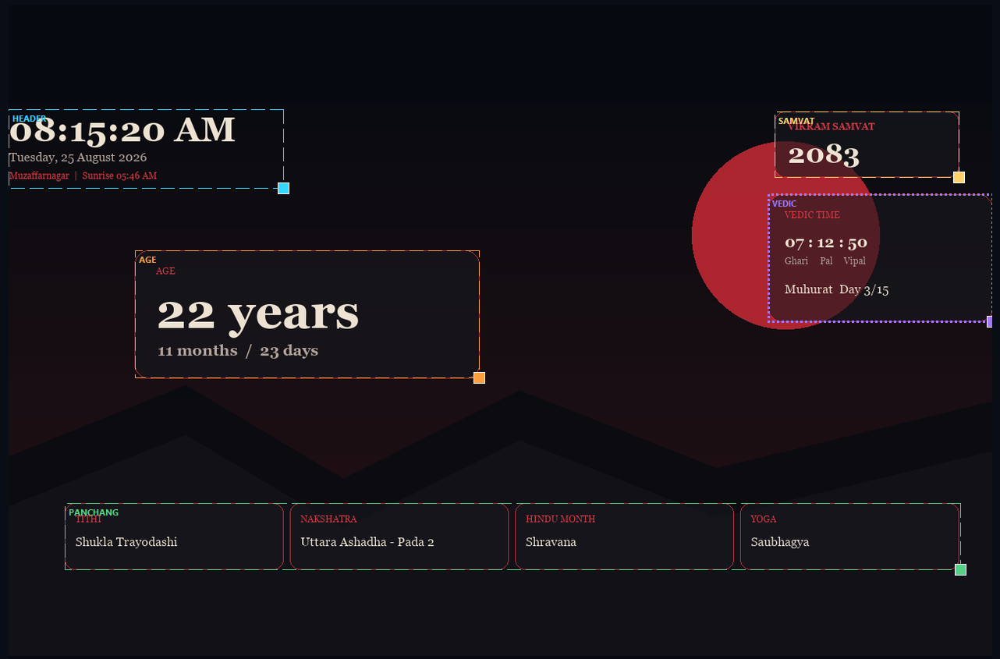
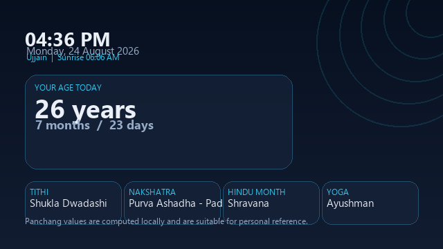
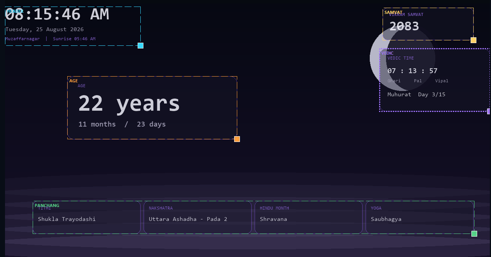
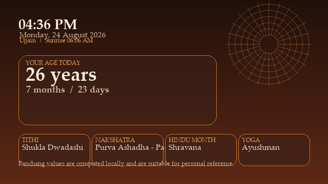

#  TimeWall Desktop Wallpaper : Age, live Time, location based Panchang 

A lightweight Windows utility that turns your desktop wallpaper into a personal age, clock, Vedic-time, and Panchang dashboard.
## Lets Talk About PERFORMANCE before Features:

- Static background, age, theme and Panchang are cached at startup and rebuilt only on startup `(once per day)`
- Only clock and Ghari/Pal/Vipal regions are patched every second.
- Output is encoded in a reused BytesIO buffer, then atomically written to one rotating `%TEMP%\TimeWall` JPEG file

- Performance at 1920×1080: approximately 1.8 ms patching plus 15.5 ms encoding/writing per update
- Live patching averages approximately 0.45 ms at 1440×810.
1
- Rendering pauses while a maximized/full-screen app obscures the desktop. Visibility is rechecked every five seconds.
- `Windows Battery Saver` switches live updates from 1 second to 1 minute `automatically`
- Wallpaper rendering uses 75% of native resolution (optimisation)
- Pillow image, drawing context, fonts, patch backgrounds and `BytesIO buffer` are reused $$(significantly-reduces-disk-wear-out)$$
- Wallpaper output uses a sharp quality-95 JPEG with 4:4:4 color to minimize text artifacts and disk writes

- now added jpeg format in RAM I/O rather than bmp that saves 90% read/write complexity

**So all & all you should not care about performace overhead at all!**

 
 
 
 
 

## Included Features

- Exact age in years, months, and days
- Current clock and date
- Sunrise-based Ghari, Pal, and Vipal
- Vikram Samvat year in its own draggable and resizable card, using the common appearance controls
- Locally calculated Tithi, Nakshatra, Yoga, Hindu lunar month, sunrise, and Muhurat period
- Ten preset Indian cities, custom coordinates, and opt-in IP location detection
- Five generated themes plus a custom background-image mode
- Custom text, accent, panel fill, and panel outline colors
- Independent opacity controls for text, accent labels, panel fills, and outlines
- Theme-specific palettes and opacity presets, with one-click reset to the selected theme defaults
- Debounced automatic settings persistence and a permanent live preview workspace
- Interactive drag-and-resize editing for the header, age card, Vedic card, and Panchang row
- Proportional inner typography and spacing when an outer layout group is resized
- Draggable divider for resizing the settings sidebar, with the width saved automatically
- Cached daily base frame; only the clock and Ghari/Pal/Vipal regions are redrawn each second
- Rendering at 75% of the native display resolution, with Windows scaling the wallpaper to the screen
- Reused Pillow image, drawing context, live-region backgrounds, fonts, and in-memory output buffer
- Quality-95 JPEG output followed by an atomic write to one rotating `%TEMP%` wallpaper file
- Automatic render pause while a maximized or full-screen foreground window obscures the desktop
- Automatic one-minute update interval while Windows Battery Saver is active
- Windows system-tray controls
- Optional start-with-Windows setting
- 
Panchang values use local, low-precision astronomical calculations suitable for a personal wallpaper.

# Download 
Please give it a STAR ⭐  it makes me feel happy to develop more such tools for you 
### a) Latest Release (Download here): 

 

### b) All Version Releases:
-> you can check and download all releases  [here](https://github.com/bro-tinka/TimeWall/releases) 

